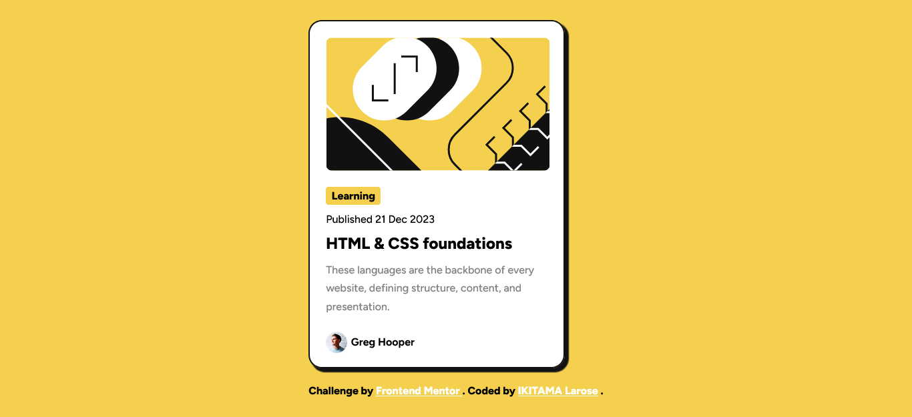

# Frontend Mentor - Blog preview card solution

This is a solution to the [Blog preview card challenge on Frontend Mentor](https://www.frontendmentor.io/challenges/blog-preview-card-ckPaj01IcS). Frontend Mentor challenges help you improve your coding skills by building realistic projects. 

## Table of contents

- [Frontend Mentor - Blog preview card solution](#frontend-mentor---blog-preview-card-solution)
  - [Table of contents](#table-of-contents)
  - [Overview](#overview)
    - [The challenge](#the-challenge)
    - [Screenshot](#screenshot)
    - [Links](#links)
  - [My process](#my-process)
    - [Built with](#built-with)
    - [What I learned](#what-i-learned)
    - [Continued development](#continued-development)
    - [Useful resources](#useful-resources)
  - [Author](#author)

**Note: Delete this note and update the table of contents based on what sections you keep.**

## Overview

### The challenge

Users should be able to:

- See hover and focus states for all interactive elements on the page

### Screenshot




### Links

- Solution URL: [See the repository](https://github.com/ikitamalarose/blog-preview-card-main-challenge.git)
- Live Site URL: [Go to the site](https://blog-preview-card-main-challenge.vercel.app/)

## My process

### Built with

- Semantic HTML5 markup
- CSS custom properties
- Flexbox
- CSS Grid

### What I learned

I learned a trick to centre a block in the body and also the creation of space between the lines.

```css
body {
    display: grid;
    place-content: center;
    height: 100vh;
}
.card__content {
    line-height: 1.7rem;
}
```
### Continued development

Learn and practice more about CSS animations.

### Useful resources

- [CSS transtions documentation FR](https://developer.mozilla.org/fr/docs/Web/CSS/CSS_transitions/Using_CSS_transitions) - This helped me for the transition


## Author

- Frontend Mentor - [@ikitamalarose](https://www.frontendmentor.io/profile/ikitamalarose)
- Twitter - [@ikitamalarose](https://www.twitter.com/ikitamalarose)


